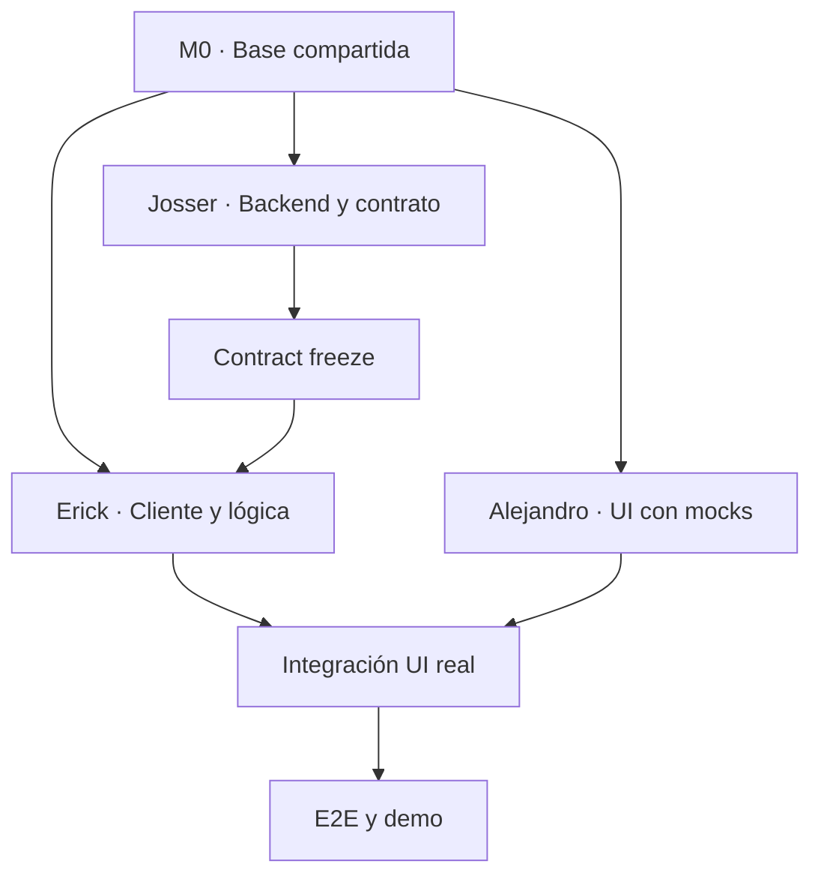

# ROADMAPV4 — Cierre ejecutable del MVP de Vivienda Match AI

> **Reto 03 · Perfilamiento inteligente de leads (Colsubsidio × 30X)**  
> **Fecha límite:** domingo 26 de julio de 2026, 11:30 a. m. — hora de Bogotá  
> **Equipo:** Erick, Alejandro y Josser  
> **Punto de partida:** A0–A4.7 implementado y validado localmente  
> **Propósito de esta versión:** reemplazar `ROADMAPV3.md` como plan de ejecución para la demostración

---

## 0. Estado de las tareas (al 2026-07-25)

| Tarea | Responsable | Estado | Nota corta |
|---|---|---|---|
| **M0** — Base compartida y ramas | Los tres | ✅ **COMPLETADO (estado: done)** | Base commiteada, contrato preliminar listo. |
| **J1** — Config reproducible + endpoints seguros | Josser | 🟡 **EN PROCESO (estado: partial)** | `.env` OK; `/admin/*`, `/analytics/*`, `/ai/*` aún públicos. |
| **J2** — Integridad del scoring y recomendador | Josser | ❌ **SIN TERMINAR (estado: not-started)** | Bono por campaña (+15 %) no eliminado. |
| **J3** — Chat con LLM y fallback | Josser | ❌ **SIN TERMINAR (estado: not-started)** | Endpoint `POST /chat/messages` no existe. |
| **J4** — Contrato final y validación backend | Josser | ❌ **SIN TERMINAR (estado: not-started)** | OpenAPI no congelado. |
| **E1** — Alinear tipos, mapper y estados | Erick | ✅ **COMPLETADO (estado: done)** | Merge `c496ee0` del 24/07. |
| **E2** — Cliente API de A4.7 | Erick | ✅ **COMPLETADO (estado: done)** | `claimLead`, `updateWorkflow`, `createActivity`, `listActivities` listos. |
| **E3** — Cliente API del chat | Erick | ❌ **SIN TERMINAR (estado: not-started)** | Bloqueado por J3. |
| **E4** — Pruebas de integración frontend | Erick | 🟡 **EN PROCESO (estado: partial)** | 164/164 tests pasan; faltan casos de chat. |
| **A1** — Detalle operativo del asesor | Alejandro | ✅ **COMPLETADO (estado: done)** | Probado en vivo el 25/07 con lead `83453dbf-...`. |
| **A2** — Dashboard mínimo del asesor | Alejandro | ✅ **COMPLETADO (estado: done)** | Tres secciones con `listLeads({ pendingAssignment, assignedToMe, slaOverdue })`. |
| **A3** — Experiencia del chat | Alejandro | 🟡 **EN PROCESO (estado: partial)** | Bloqueado por J3 + E3. |
| **A4** — E2E, datos de demo y presentación | Alejandro | 🟡 **EN PROCESO (estado: partial)** | 7 escenarios documentados en `e2e/scenarios/*.md`; faltan datos sintéticos y video. |

**Leyenda:**
- ✅ **COMPLETADO (estado: done)** — entregable verificado, cumple definición de terminado.
- 🟡 **EN PROCESO (estado: partial)** — trabajo iniciado, falta parte del alcance.
- ❌ **SIN TERMINAR (estado: not-started)** — no se ha iniciado o depende de otro frente.

### 0.1 Qué falta para cerrar las tareas en proceso

**J1 (en proceso — Josser)** falta por hacer:
- Proteger `/admin/*`, `/analytics/*` con rol `SUPERVISOR` o deshabilitarlos.
- Proteger `/ai/*` con `ADVISOR` o `SUPERVISOR`.
- Auditar que los logs del backend no expongan tokens, notas ni contenido sensible.

**E4 (en proceso — Erick)** falta por hacer:
- Tests explícitos de reclamo concurrente (dos asesores).
- Tests explícitos de transición inválida de workflow.
- Tests del flujo de chat (depende de E3 y J3).

**A3 (en proceso — Alejandro)** falta por hacer:
- Sustituir el motor determinístico local (`features/prospect/engine.ts`) por la llamada al backend cuando Josser libere `POST /leads/{id}/chat/messages` y Erick exponga `sendProspectMessage`.
- Diferenciar visualmente las respuestas `LLM` vs `DETERMINISTIC_FALLBACK` en `prospect-conversation.tsx`.

**A4 (en proceso — Alejandro)** falta por hacer:
- Grabar video corto de respaldo (sábado 26/07 10:00-11:00).
- Tomar capturas de pantalla del flujo principal.
- Ejecutar los 7 escenarios E2E manualmente en navegador (sábado 14:00-17:00).
- (Opcional) Instalar Playwright si sobra tiempo.

---

## 1. Objetivo de entrega

El objetivo no es completar todas las ideas técnicas del producto. El objetivo es demostrar, de extremo a extremo, un único flujo sólido:

```text
Prospecto conversa
→ el sistema completa y persiste su perfil
→ reglas determinísticas evalúan su preparación
→ el catálogo vigente filtra proyectos compatibles
→ el recomendador ordena las alternativas válidas
→ el LLM formula preguntas y explica el resultado
→ el prospecto recibe proyectos o un plan de preparación
→ solicita contacto
→ un asesor recibe el contexto, reclama la oportunidad
→ registra una actividad y actualiza el seguimiento
→ la información continúa disponible después de recargar
```

La entrega debe ser demostrable, reproducible y honesta. No debe presentarse como aprobación de crédito, predicción de compra ni CRM productivo.

---

## 2. Estado inicial confirmado

### 2.1 Implementado hasta A4.7

- Catálogo consumido desde backend.
- Sincronización versionada mediante `POST /leads/sync`.
- Persistencia de leads, turnos, evaluaciones, recorridos, nutrición y handoff.
- Evaluación determinística autoritativa.
- Recomendador con filtros previos y fallback determinístico.
- Bandeja y detalle del asesor conectados al backend.
- JWT con roles `ADVISOR` y `SUPERVISOR`.
- Autorización por oportunidad.
- Reclamo y reasignación concurrentes.
- Workflow comercial versionado.
- Actividades idempotentes.
- Estados terminales inmutables.
- Auditoría, logs estructurados, `X-Request-ID`, métricas y health checks.

### 2.2 Evidencia existente

- 39 pruebas backend aprobadas.
- 15 pruebas backend específicas de A4.7.
- 147 pruebas frontend aprobadas.
- ESLint aprobado.
- Ruff aprobado sobre el alcance modificado.
- Build frontend aprobado con 39 páginas.
- Smoke test autenticado aprobado.

### 2.3 Brechas que sí bloquean la demostración

| ID | Brecha | Prioridad |
|---|---|---|
| B1 | La UI no consume completamente `claim`, `workflow` y `activities`. | P0 |
| B2 | Estados y valores sintéticos del frontend no están totalmente alineados con backend. | P0 |
| B3 | Falta el recorrido E2E completo en navegador. | P0 |
| B4 | El entorno no tiene un arranque limpio y reproducible suficientemente probado. | P0 |
| B5 | Rutas internas `/admin`, `/analytics` y `/ai` deben protegerse o deshabilitarse. | P0 |
| B6 | El chat debe usar un LLM real o configurable sin cederle decisiones de negocio. | P0 |
| B7 | El dashboard debe mostrar los datos operativos ya calculados por backend. | P1 |
| B8 | El modelo y la UI deben eliminar señales o mensajes asociados con marketing, fuga o “probabilidad de compra”. | P0 |

---

## 3. Alcance de esta entrega

### 3.1 Obligatorio para el MVP

1. Congelar y compartir la base A4.7.
2. Configurar un arranque limpio sin versionar secretos.
3. Proteger o deshabilitar endpoints internos.
4. Conectar en frontend:
   - Reclamo de oportunidad.
   - Cambio de estado.
   - Registro y consulta de actividades.
   - Manejo de conflictos `403` y `409`.
   - Persistencia comprobable al recargar.
5. Eliminar score sintético y estados comerciales locales incompatibles.
6. Implementar chat mínimo con:
   - Un proveedor LLM.
   - Salida estructurada.
   - Validación determinística.
   - Persistencia en la estructura existente.
   - Fallback determinístico.
7. Mostrar en el dashboard:
   - Oportunidades por reclamar.
   - Asignadas al asesor.
   - SLA o seguimiento vencido.
   - Próxima acción.
8. Auditar el scoring y bloquear variables indebidas.
9. Conservar el origen multicanal como contexto del lead, sin usarlo para scoring ni ranking.
10. Completar pruebas backend, frontend, build, smoke y E2E.
11. Preparar datos de demostración, video y ensayo.

### 3.2 Solo si el camino crítico está completamente verde

- Filtros avanzados adicionales en la bandeja.
- Vista mínima de reasignación para supervisor.
- Mejoras visuales no funcionales.
- Documentación adicional no necesaria para ejecutar la demo.

### 3.3 Diferido después de la demostración

- PostgreSQL.
- CI/CD completo.
- Staging y despliegue productivo.
- Backups y recuperación.
- Observabilidad centralizada.
- Cola offline y resincronización.
- Migración general de `localStorage`.
- Multi-proveedor LLM.
- Dataset automático de reentrenamiento.
- Evaluación MLOps continua.
- Scraping y enriquecimiento de perfiles.
- Analítica gerencial.
- Integración con calendario, correo, WhatsApp o CRM.

### 3.4 Fuera del alcance del reto

- Estrategia de pauta o marketing.
- Integración real con CRM.
- Integración real con DataCrédito.
- Integración con el bot actual del contact center.
- Aprobación o rechazo de crédito hipotecario.
- Firma de promesa de compraventa.
- Gestión documental.
- Escrituración, desembolso o posventa.
- Construcción de un CRM comercial completo.

---

## 4. Principios técnicos no negociables

### 4.1 Autoridad de decisión

```text
Reglas determinísticas
→ deciden la ruta de preparación

Catálogo vigente
→ descarta proyectos incompatibles o cerrados

Recomendador
→ ordena únicamente proyectos válidos

LLM
→ pregunta, extrae señales permitidas y explica
```

El LLM no puede:

- Calcular capacidad financiera oficial.
- Aprobar o rechazar crédito.
- Cambiar la ruta comercial.
- Saltarse filtros de compatibilidad.
- Seleccionar proyectos fuera del Top 3 autorizado por backend.
- Convertir afinidad en “probabilidad de compra”.

### 4.2 Una sola fuente de verdad para la conversación

No se creará `chat_messages` como segunda fuente de verdad mientras ya exista `conversation_turns`.

Para el MVP se reutilizará `conversation_turns` y se ampliará solo si faltan metadatos imprescindibles:

- `client_message_id`.
- `provider`.
- `model`.
- `prompt_version`.
- `response_source`: `LLM` o `DETERMINISTIC_FALLBACK`.
- `extracted_signals_json`.
- `created_at`.

Si la migración de columnas pone en riesgo el plazo, esos metadatos se almacenarán en la estructura JSON ya existente y se normalizarán después de la demo.

### 4.3 Seguridad del chat público

Un endpoint público no puede permitir escribir usando únicamente `lead_id` o `session_id`.

El backend debe emitir una credencial corta para la sesión del prospecto:

```text
sub = session_id
aud = prospect-chat
exp = corta duración
```

Las escrituras de chat deben exigir esa credencial y un `client_message_id` o `Idempotency-Key`. El token del prospecto nunca será `NEXT_PUBLIC_*` ni se compartirá con el token del asesor.

### 4.4 Secretos y configuración

- Nunca se versiona `.env`.
- Sí se versiona `.env.example` sin valores reales.
- `JWT_SECRET` debe validarse al iniciar.
- `NEXT_PUBLIC_ADVISOR_ACCESS_TOKEN` solo es aceptable para demo local con datos sintéticos.
- El token de demo debe regenerarse antes de la presentación.
- Ningún secreto, token, nota o dato sensible debe aparecer en logs.

### 4.5 Integridad analítica mínima

La lista prohibida para features debe incluir, como mínimo:

```text
MEDIO
INMUEBLE
DESISTIMIENTO
FECHA_DESISTIMIENTO
FECHA_OPCION
ENTIDAD_CREDITO
EMPRESA_FOCO
PROCESO
channel
campaign
```

También debe eliminarse cualquier bono de recomendación ligado a campaña o canal.

Si el artefacto CatBoost necesita una variable prohibida, se deshabilita para la demo y se usa el fallback determinístico. No se simula ni se completa silenciosamente esa variable.

Los campos `acquisition.source`, `campaign`, `content` y `lead_reference` pueden conservarse para demostrar que el flujo admite leads provenientes de web, Meta, WhatsApp o contact center. Se tratan únicamente como trazabilidad de origen y contexto para el asesor.

---

## 5. Estrategia de equipo para no pisarse

La división se hace por ownership de módulos, no por una lista mezclada de tareas.

| Responsable | Frente | Resultado principal |
|---|---|---|
| Josser | Backend, seguridad, IA, scoring y contratos | Backend seguro y contrato congelado |
| Erick | Cliente API y lógica comercial frontend | Integración tipada de todas las operaciones |
| Alejandro | Páginas, UX integrada, E2E y demo | Flujo visible, usable y probado en navegador |

### 5.1 Ownership exclusivo de Josser

```text
vivienda-ai-backend/**
vivienda-ai-backend/docs/openapi.json
```

Solo Josser modifica:

- Schemas y endpoints backend.
- Migraciones.
- Autenticación y autorización.
- Scoring y recomendador.
- Orquestación del LLM.
- OpenAPI del backend.
- Pruebas backend.

### 5.2 Ownership exclusivo de Erick

```text
vivienda-ai-frontend/lib/api/**
vivienda-ai-frontend/features/advisor/backend-lead-mapper.ts
vivienda-ai-frontend/features/advisor/commercial.ts
vivienda-ai-frontend/features/advisor/workflow.ts
vivienda-ai-frontend/features/advisor/components/commercial-actions.tsx
vivienda-ai-frontend/features/advisor/**/__tests__/**
```

Solo Erick:

- Regenera `lib/api/generated.ts`.
- Cambia el cliente HTTP.
- Traduce códigos de error.
- Implementa `claim`, `workflow`, `activities` y cliente del chat.
- Mantiene la lógica comercial reusable del frontend.

### 5.3 Ownership exclusivo de Alejandro

```text
vivienda-ai-frontend/app/asesor/**
vivienda-ai-frontend/app/orientacion/**
vivienda-ai-frontend/features/prospect/**
vivienda-ai-frontend/features/advisor/components/backend-lead-detail.tsx
vivienda-ai-frontend/features/advisor/components/commercial-dashboard.tsx
vivienda-ai-frontend/e2e/**
vivienda-ai-frontend/README.md
```

Alejandro:

- Consume las funciones que expone Erick.
- Integra páginas y estados visuales.
- Implementa el chat visible.
- Ejecuta y documenta el E2E.
- Prepara capturas, video y datos de demo.

### 5.4 Archivos compartidos

| Archivo | Propietario temporal |
|---|---|
| `lib/api/generated.ts` | Erick |
| `.env.example` backend | Josser |
| `.env.example` frontend | Erick |
| README raíz o guía de demo | Alejandro |
| `package.json` y lockfile frontend | Erick |
| Dependencias backend | Josser |

Si otra persona necesita cambiar un archivo que no posee:

1. No lo edita directamente.
2. Abre una solicitud corta al propietario.
3. El propietario realiza el cambio o transfiere explícitamente el ownership.
4. El cambio se registra en el PR correspondiente.

---

## 6. Flujo Git obligatorio

La regla anterior de “no hacer commit ni push” queda reemplazada para permitir trabajo en equipo.

### 6.1 Preparación

En cada repositorio:

```text
desarrollo
└── integration/demo-2026-07-26
```

Ramas de trabajo:

```text
Backend
└── feat/josser-backend-demo

Frontend
├── feat/erick-advisor-api
└── feat/alejandro-ui-e2e
```

### 6.2 Reglas

1. La base A4.7 se valida, commitea y sube antes de dividir el trabajo.
2. Nadie trabaja directamente sobre `desarrollo`.
3. Nadie trabaja directamente sobre `integration/demo-2026-07-26`.
4. Todo cambio entra por PR hacia la rama de integración.
5. Un archivo tiene un solo propietario a la vez.
6. No se agregan dependencias sin informar al equipo.
7. No se cambia un DTO después del contract freeze sin aviso explícito.
8. No se versionan `.env`, bases SQLite, logs, artefactos de entrenamiento ni tokens.
9. No se hace force-push sobre ramas compartidas.
10. Cada PR debe indicar:
    - Alcance.
    - Archivos principales.
    - Pruebas ejecutadas.
    - Riesgos pendientes.
11. Josser realiza los merges finales.
12. La rama `desarrollo` solo recibe el merge cuando el E2E esté verde.

### 6.3 Orden de integración

```text
1. Backend de Josser + OpenAPI congelado
2. Cliente API y lógica de Erick
3. Páginas y UX de Alejandro
4. Pruebas integradas
5. Code freeze
6. Demo
```

### 6.4 Contract freeze

Antes del trabajo paralelo, Josser publica el contrato mínimo:

- Rutas.
- Métodos.
- DTO de entrada.
- DTO de salida.
- Estados comerciales.
- Códigos de error.
- Requisitos de autenticación.
- Cabeceras de idempotencia.

Erick genera o actualiza los tipos una sola vez después del freeze. Alejandro trabaja inicialmente con las mismas interfaces y reemplaza los mocks cuando Erick integre el cliente.

---

## 7. Plan de ejecución

### M0 — Congelar la base y habilitar trabajo paralelo

**Responsables:** los tres  
**Duración objetivo:** 45–60 minutos  
**Dependencias:** ninguna  
**Prioridad:** P0

#### M0.1 Validar la base A4.7

- Confirmar pruebas backend y frontend.
- Confirmar que no hay secretos ni bases SQLite en Git.
- Revisar el diff acumulado.
- Hacer commit y push de la base aprobada.

#### M0.2 Crear ramas

- Crear `integration/demo-2026-07-26`.
- Crear las tres ramas de trabajo.
- Registrar ownership de archivos.

#### M0.3 Congelar contrato

- Josser publica OpenAPI y tabla de errores.
- Erick confirma que puede generar tipos.
- Alejandro confirma que los componentes pueden consumir las interfaces.

#### Definición de terminado

- Los tres trabajan sobre el mismo commit base.
- Las ramas remotas existen.
- El contrato mínimo está disponible.
- No hay secretos ni artefactos locales versionados.

---

### J1 — Configuración reproducible y endpoints seguros **(estado: EN PROCESO)**

**Responsable:** Josser  
**Dependencia:** M0  
**Prioridad:** P0  
**Estado:** 🟡 **EN PROCESO**

#### Entregables

1. ✅ Validación de configuración al arrancar. *(`JWT_SECRET` validado en `auth.py`; rechaza secretos < 32 chars.)*
2. ✅ `.env.example` completo y seguro.
3. ✅ Puerto backend unificado en `3001`. *(También corregido en `vivienda-ai-backend/.env` durante la auditoría.)*
4. ❌ `/admin/*` y `/analytics/*` protegidos con `SUPERVISOR` o deshabilitados. *(**BUG:** siguen públicamente accesibles.)*
5. ❌ `/ai/*` protegido según su consumidor. *(**BUG:** accesible sin token.)*
6. ✅ Token de asesor documentado como demo-only.
7. ❌ Logs sin tokens, notas ni contenido sensible. *(No auditado.)*

#### Pruebas

- ✅ Sin token: `401`.
- ✅ `ADVISOR` contra ruta de supervisor: `403` *(no aplicado a admin/analytics/ai, por punto 4).*
- ❌ `SUPERVISOR`: `200`. *(No se puede validar porque las rutas siguen públicas.)*
- ✅ Sin `JWT_SECRET`: arranque rechazado con mensaje seguro.
- ✅ El repositorio no contiene `.env`, JWT ni bases `.db`. *(`test_vivienda_match.db` aún está en la raíz; agregar a `.gitignore`.)*

#### Definición de terminado

Las rutas internas no son públicas y cualquier integrante puede arrancar el backend siguiendo la configuración documentada.

---

### J2 — Integridad mínima del scoring y recomendador **(estado: SIN TERMINAR)**

**Responsable:** Josser  
**Dependencia:** M0  
**Prioridad:** P0  
**Estado:** ❌ **SIN TERMINAR**

#### Entregables

1. ❌ Inventario exacto de features utilizadas por CatBoost.
2. ❌ Allowlist de variables permitidas.
3. ❌ Denylist automática para variables posteriores, identificadores y marketing.
4. ❌ Eliminación del bono de campaña o canal. *(**BUG:** `recommender.py` aplica +15 % por campaña.)*
5. ❌ Corrección de textos que afirmen “probabilidad de compra”.
6. ❌ Fallback determinístico si el artefacto actual depende de una variable prohibida.
7. ❌ Catálogo vigente aplicado antes del ranking.

#### Pruebas

- ❌ Un test falla si entra `MEDIO`, `channel`, `campaign`, `INMUEBLE` o desistimiento.
- ❌ Un proyecto cerrado o incompatible nunca aparece.
- ❌ El fallback produce una salida válida si CatBoost está deshabilitado.
- ❌ La API usa “afinidad histórica”, “compatibilidad” o “preparación orientativa”.

#### Definición de terminado

La recomendación no aprende ni comunica información asociada con fuga, marketing, aprobación crediticia o resultado futuro.

---

### J3 — Chat mínimo con LLM, persistencia y fallback **(estado: SIN TERMINAR)**

**Responsable:** Josser  
**Dependencias:** M0 y J1  
**Prioridad:** P0  
**Estado:** ❌ **SIN TERMINAR**

#### Diseño obligatorio

1. ❌ Reutilizar `conversation_turns`.
2. ❌ Emitir credencial temporal para la sesión del prospecto.
3. ❌ Exigir `client_message_id` o `Idempotency-Key`.
4. ❌ Persistir mensaje de usuario y respuesta.
5. ❌ Invocar un único proveedor LLM.
6. ❌ Validar salida mediante schema.
7. ❌ Aplicar señales extraídas solo después de validarlas.
8. ❌ Recalcular ruta y recomendaciones con servicios determinísticos.
9. ❌ Entregar al LLM únicamente el resultado autorizado para explicarlo.
10. ❌ Usar fallback determinístico ante timeout, error, salida vacía o schema inválido.

#### Contrato conceptual

```json
{
  "client_message_id": "uuid",
  "content": "mensaje del prospecto",
  "session_version": 4
}
```

Respuesta:

```json
{
  "user_turn_id": "uuid",
  "assistant_turn_id": "uuid",
  "assistant_text": "respuesta conversacional",
  "response_source": "LLM",
  "missing_fields": [],
  "route": "ruta decidida por reglas",
  "recommendations": [],
  "nurture_plan": {},
  "session_version": 5
}
```

El LLM no devuelve una ruta autoritativa ni IDs de proyecto libres. Esos campos son incorporados por backend después de ejecutar reglas y recomendador.

#### Pruebas

- ❌ Mensaje vacío o mayor al límite: `422`.
- ❌ Credencial ausente, vencida o de otra sesión: `401/403`.
- ❌ Reintento con el mismo identificador: no duplica turnos.
- ❌ Timeout del proveedor: respuesta determinística válida.
- ❌ Salida inválida del LLM: fallback válido.
- ❌ Un prompt del usuario no puede forzar proyectos incompatibles.
- ❌ El asesor autorizado puede consultar la conversación del lead.

#### Definición de terminado

El prospecto puede enviar un mensaje, recibir una respuesta contextual, recargar y recuperar el recorrido sin duplicidades; si el LLM falla, el flujo continúa.

---

### J4 — Contrato final y validación backend **(estado: SIN TERMINAR)**

**Responsable:** Josser  
**Dependencias:** J1, J2 y J3  
**Prioridad:** P0  
**Estado:** ❌ **SIN TERMINAR**

#### Entregables

- ❌ OpenAPI actualizado.
- ❌ Códigos de error documentados.
- ❌ Tipos y estados sin contradicciones.
- ❌ Pruebas backend completas.
- ❌ Smoke autenticado.

#### Gate para frontend

Josser comunica:

```text
CONTRACT FREEZE — DEMO 2026-07-26
```

Después de este punto solo se permiten cambios compatibles o correcciones de bloqueadores.

---

### E1 — Alinear tipos, mapper y estados del frontend **(estado: COMPLETADO)**

**Responsable:** Erick  
**Dependencia:** M0; cierre final después de J4  
**Prioridad:** P0  
**Estado:** ✅ **COMPLETADO** (merge commit `c496ee0`)

#### Entregables

1. ✅ Eliminar `readiness_score` sintético.
2. ✅ Usar el score o nivel autoritativo del backend.
3. ✅ Adoptar estados oficiales:
   - `PENDING`.
   - `ASSIGNED`, si existe en el contrato final.
   - `IN_PROGRESS`.
   - `FOLLOW_UP`.
   - `APPOINTMENT_SCHEDULED`.
   - `CLOSED_WON`.
   - `CLOSED_LOST`.
   - `OPTED_OUT`.
4. ✅ Eliminar traducciones que cambien el significado del dominio.
5. ✅ Regenerar `generated.ts` después del contract freeze.

#### Pruebas

- El mapper conserva exactamente score, estado, versión y SLA.
- No existen los estados locales incompatibles.
- No se inventan números cuando el backend no envía score.

#### Definición de terminado

Frontend y backend comparten los mismos tipos, estados y significado comercial.

---

### E2 — Cliente API de A4.7 **(estado: COMPLETADO)**

**Responsable:** Erick  
**Dependencias:** M0 y contrato preliminar  
**Prioridad:** P0  
**Estado:** ✅ **COMPLETADO** (merge commit `c496ee0`)

#### Entregables

- ✅ `claimLead`.
- ✅ `updateWorkflow`.
- ✅ `createActivity`.
- ✅ `listActivities`.
- ✅ Soporte de `Idempotency-Key`.
- ✅ Reutilización segura de la misma key durante un reintento.
- ✅ Refresco del lead después de cada mutación.

#### Errores que debe traducir

| Código backend | Mensaje visible |
|---|---|
| `LEAD_ALREADY_ASSIGNED` | Esta oportunidad ya fue tomada por otro asesor. |
| `STALE_WORKFLOW_VERSION` | La oportunidad cambió. Recarga la información antes de continuar. |
| `INVALID_WORKFLOW_TRANSITION` | Ese cambio no está permitido desde el estado actual. |
| `TERMINAL_WORKFLOW_IMMUTABLE` | La oportunidad está cerrada y no puede modificarse. |
| `ACTIVITY_IDEMPOTENCY_CONFLICT` | La actividad ya fue registrada o el reintento no coincide. |
| `RESOURCE_FORBIDDEN` | No tienes permiso para operar esta oportunidad. |

#### Pruebas

- ✅ `200` en flujo válido (verificado en vivo el 25/07 con lead `83453dbf-...`).
- ✅ `403` por acceso horizontal.
- ✅ `409` por reclamo concurrente.
- ✅ `409` por versión antigua.
- ✅ Reintento de actividad sin duplicidad.

#### Definición de terminado

Ninguna acción comercial esencial depende de `localStorage`.

---

### E3 — Cliente API del chat **(estado: SIN TERMINAR — bloqueado por J3)**

**Responsable:** Erick  
**Dependencia:** contrato preliminar de J3  
**Prioridad:** P0  
**Estado:** ❌ **SIN TERMINAR** (J3 no ha liberado `POST /leads/{id}/chat/messages`)

#### Entregables

- `sendProspectMessage`.
- `getProspectConversation`, si el contrato lo requiere.
- Soporte de credencial de sesión.
- `client_message_id`.
- Manejo de timeout, error y fallback reportado por backend.
- Tipos que diferencien `LLM` y `DETERMINISTIC_FALLBACK`.

#### Definición de terminado

Alejandro puede integrar la conversación sin construir llamadas HTTP dentro de componentes.

---

### E4 — Pruebas de integración frontend **(estado: EN PROCESO)**

**Responsable:** Erick  
**Dependencias:** E1, E2 y E3  
**Prioridad:** P0  
**Estado:** 🟡 **EN PROCESO** (E2 cubierto; falta E3 y casos 6–8)

#### Casos mínimos

1. ✅ Reclamo exitoso.
2. ✅ Reclamo concurrente.
3. ✅ Transición válida.
4. ✅ Versión de workflow obsoleta.
5. ✅ Actividad idempotente.
6. 🟡 Acceso prohibido (cubierto por helper de errores, no test explícito).
7. ❌ Mensaje de chat exitoso (depende de E3).
8. ❌ Fallback del chat (depende de E3).

**Resultado:** 164/164 tests pasan (147 previos + 17 nuevos de `lib/api/__tests__/`).

#### Definición de terminado

Las pruebas nuevas y las 147 existentes quedan verdes.

---

### A1 — Detalle operativo del asesor **(estado: COMPLETADO)**

**Responsable:** Alejandro  
**Dependencia:** interfaces preliminares de E2  
**Prioridad:** P0  
**Estado:** ✅ **COMPLETADO**

#### Entregables

- ✅ Renderizar `CommercialActions`. *(AdvisorActionsPanel integrado en `backend-lead-detail.tsx`.)*
- ✅ Mostrar estado, asesor asignado, próxima acción y seguimiento. *(Pill de estado, versión del workflow, `next_action`.)*
- ✅ Mostrar historial persistido de actividades. *(Pestaña "Actividades" con `listActivities(id)`.)*
- ✅ Estados de carga, vacío, error y conflicto. *(LOADING con skeleton, EMPTY con mensaje, ERROR con reintento, 404 `COMMERCIAL_WORKFLOW_NOT_FOUND` como EMPTY.)*
- ✅ Recargar el detalle después de mutaciones. *(Evento `vivienda:lead-refresh` disparado por cada acción.)*
- 🟡 Eliminar lecturas canónicas desde `features/advisor/storage.ts`. *(`AdvisorActionsPanel` ya no lee del storage; queda en A2.)*

#### Definición de terminado

Un asesor puede reclamar, gestionar y registrar una actividad desde el navegador, y la información sigue presente después de recargar.

**Verificación (2026-07-25, lead `83453dbf-...`):** `POST /leads/{id}/claim` → 200, `PATCH /leads/{id}/workflow` → 200, `POST /leads/{id}/activities` → 201 con `Idempotency-Key`, `GET /leads/{id}/activities` → 200 con la actividad visible. Estado persistido tras `Ctrl+R`.

---

### A2 — Dashboard mínimo del asesor **(estado: COMPLETADO)**

**Responsable:** Alejandro  
**Dependencia:** interfaces de E1 y E2  
**Prioridad:** P1  
**Estado:** ✅ **COMPLETADO**

#### Entregables

Tres vistas o bloques son suficientes:

1. ✅ Por reclamar. *(`listLeads({ pendingAssignment: true })`)*
2. ✅ Asignadas a mí. *(`listLeads({ assignedToMe: true })`)*
3. ✅ SLA o seguimiento vencido. *(`listLeads({ slaOverdue: true })`)*

Cada tarjeta muestra:

- ✅ Prospecto. *(Iniciales + nombre en `LeadItemRow`)*
- ✅ Ruta o nivel de preparación. *(`safeRoute(item.route)` con fallback)*
- ✅ Estado. *(Pill de prioridad)*
- ✅ SLA. *(Pill "SLA vencido" si `sla_overdue`, sino "Seguimiento {fecha}")*
- ✅ Próxima acción. *(`item.next_action`)*
- ✅ Fecha de seguimiento. *(`formatDateTime(item.next_follow_up_at)`)*

El orden lo entrega backend. La UI no duplica la priorización.

#### Definición de terminado

El asesor identifica qué atender primero usando datos reales del backend.

**Implementación:** `commercial-dashboard.tsx` reemplazó `useCommercialStates()` y `useQualifiedLeads()` por tres llamadas paralelas a `listLeads()` con los filtros del backend. La sección activa se navega con tabs (`CLAIM` / `ASSIGNED` / `SLA`), cada una muestra el conteo y la lista. El detalle se renderiza via `LeadDetailClient`.

---

### A3 — Experiencia del chat **(estado: EN PROCESO — bloqueado por J3 y E3)**

**Responsable:** Alejandro  
**Dependencia:** interfaz preliminar de E3  
**Prioridad:** P0  
**Estado:** 🟡 **EN PROCESO** (bloqueado por backend)

#### Entregables

- Enviar mensaje del prospecto.
- Mostrar respuesta y estado de carga.
- Diferenciar visualmente una respuesta degradada sin alarmar al usuario.
- Mostrar:
  - Pregunta siguiente.
  - Proyectos autorizados, o
  - Plan de preparación.
- Recuperar el recorrido al recargar.
- No exponer tokens, prompts ni errores internos.

Alejandro puede iniciar con un mock que respete exactamente la interfaz de E3. No debe editar `lib/api/chat.ts`.

#### Definición de terminado

El chat funciona con respuesta LLM y con fallback determinístico sin romper la experiencia.

---

### A4 — E2E, datos de demo y presentación **(estado: EN PROCESO)**

**Responsable:** Alejandro  
**Apoyo:** Josser y Erick para bloqueadores de sus módulos  
**Dependencias:** J4, E4, A1, A2 y A3  
**Prioridad:** P0  
**Estado:** 🟡 **EN PROCESO**

#### Escenarios E2E obligatorios

1. Prospecto preparado:
   - Completa perfil.
   - Recibe hasta tres proyectos compatibles.
   - Solicita contacto.
2. Prospecto no preparado:
   - Recibe plan de acompañamiento.
   - No recibe proyectos incompatibles.
3. Handoff:
   - El lead aparece en la bandeja.
   - El asesor lo reclama.
   - Registra contacto o seguimiento.
4. Persistencia:
   - Se recarga la página.
   - Estado, actividad y conversación permanecen.
5. Concurrencia:
   - Un segundo asesor intenta reclamar.
   - Recibe `409`.
6. Autorización:
   - Sin token: `401`.
   - Asesor sin acceso: `403`.
7. Degradación:
   - Falla el LLM.
   - El fallback completa el recorrido.

**Avance 2026-07-25:**
- ✅ 7 escenarios documentados en `vivienda-ai-frontend/e2e/scenarios/*.md`.
- ❌ Scripts Playwright no instalados (decisión de scope).
- ❌ Video de respaldo no grabado (sábado 26/07 10:00–11:00).
- 🟡 Datos sintéticos: solo Jonathan listo (`83453dbf-...`). Faltan Camila, Laura, Andrés.

#### Evidencia

- Capturas del flujo principal.
- Video corto de respaldo.
- Resultado de pruebas.
- Commit exacto usado.
- Comandos de arranque.
- Riesgos conocidos.

#### Definición de terminado

El equipo puede ejecutar la demo dos veces seguidas desde un arranque limpio sin intervención manual en la base de datos.

---

## 8. Dependencias entre frentes



### Handoffs obligatorios

| Entrega | Emisor | Receptor | Condición |
|---|---|---|---|
| Contrato preliminar | Josser | Erick y Alejandro | Antes del trabajo paralelo |
| OpenAPI congelado | Josser | Erick | Backend verde |
| Cliente API integrado | Erick | Alejandro | Tipos y tests verdes |
| UI integrada | Alejandro | Equipo | Build verde |
| Reporte E2E | Alejandro | Equipo | Siete escenarios ejecutados |

---

## 9. Cronograma

### Viernes 24 de julio — Bloque inicial

#### Los tres

- Ejecutar M0.
- Validar base.
- Hacer commit y push.
- Crear ramas.
- Congelar contrato preliminar.
- Levantar backend y frontend desde cero.

#### Salida del día

- Ningún integrante trabaja sobre una base diferente.
- Ownership y dependencias quedan aceptados.

---

### Sábado 25 de julio — Mañana

#### Josser

- J1: configuración y seguridad.
- J2: integridad mínima del scoring.
- Contrato preliminar de J3.

#### Erick

- E1: estados y mapper.
- E2: cliente API comercial.

#### Alejandro

- A1: detalle operativo con mocks.
- A3: UI del chat con mocks.

#### Integración del mediodía

- Merge de J1 y J2.
- Validación del contrato.
- Ajustes compatibles.

---

### Sábado 25 de julio — Tarde

#### Josser

- J3: chat, persistencia y fallback.
- J4: pruebas y OpenAPI.

#### Erick

- E3: cliente del chat.
- E4: pruebas de integración frontend.

#### Alejandro

- Sustituir mocks por cliente real.
- A2: dashboard mínimo.
- Preparar datos E2E.

#### Integración nocturna

1. Merge backend.
2. Regeneración de tipos.
3. Merge de Erick.
4. Merge de Alejandro.
5. Backend tests.
6. Frontend tests.
7. ESLint.
8. Build.
9. Smoke.

#### Code freeze

Después del code freeze solo se aceptan:

- Correcciones de P0.
- Fallos de pruebas.
- Errores de arranque.
- Bloqueadores de la demostración.

No se aceptan nuevas pantallas, refactors amplios ni dependencias.

---

### Domingo 26 de julio — Antes de las 11:30 a. m.

#### 7:00–9:00

- Ejecutar los siete escenarios E2E.
- Probar arranque limpio.
- Probar recarga.
- Probar fallback.

#### 9:00–10:15

- Corregir únicamente bloqueadores.
- Repetir pruebas afectadas.
- Confirmar commit de demo.

#### 10:15–11:00

- Grabar video.
- Preparar capturas.
- Ensayar pitch técnico y funcional.

#### 11:00–11:30

- Buffer.
- No desarrollar nuevas funcionalidades.

---

## 10. Gates de calidad

### Gate 1 — Base compartida

- Commit A4.7 identificado.
- Ramas creadas.
- Secretos fuera de Git.
- Contrato preliminar disponible.

### Gate 2 — Backend

- Pruebas existentes y nuevas aprobadas.
- Rutas internas protegidas.
- Chat idempotente y autorizado.
- Fallback validado.
- OpenAPI congelado.

### Gate 3 — Frontend

- Pruebas existentes y nuevas aprobadas.
- ESLint aprobado.
- TypeScript aprobado.
- Build de producción aprobado.
- Sin acciones comerciales canónicas en `localStorage`.

### Gate 4 — Integración

- Smoke autenticado.
- Prospecto listo y no listo funcionan.
- Handoff funciona.
- Claim, workflow y actividad funcionan.
- Recarga conserva estado.

### Gate 5 — Demo

- Siete escenarios E2E aprobados.
- Video de respaldo.
- Datos sintéticos de demo.
- Tokens regenerados.
- Riesgos conocidos documentados.

---

## 11. Matriz de pruebas

| Área | Caso | Responsable |
|---|---|---|
| Auth | `401`, `403`, `200` | Josser |
| Seguridad | Endpoints internos protegidos | Josser |
| Scoring | Variables prohibidas bloqueadas | Josser |
| Recomendador | Proyecto incompatible excluido | Josser |
| Chat | Sesión autorizada e idempotente | Josser |
| Chat | Timeout y schema inválido usan fallback | Josser |
| Cliente | Errores `403/409` traducidos | Erick |
| Cliente | `Idempotency-Key` reutilizada en reintento | Erick |
| Mapper | Sin score sintético | Erick |
| UI | Claim y actividad visibles | Alejandro |
| UI | Recarga recupera estado | Alejandro |
| E2E | Prospecto listo | Alejandro |
| E2E | Prospecto no listo | Alejandro |
| E2E | Dos asesores reclaman | Equipo |
| Build | Lint, tipos y producción | Erick |

---

## 12. Riesgos y respuesta

| Riesgo | Señal | Respuesta |
|---|---|---|
| LLM no disponible | Timeout, `5xx` o clave ausente | Fallback determinístico; no cambiar de proveedor durante la demo |
| CatBoost usa feature prohibida | El artefacto exige `channel`, `MEDIO` u otra variable | Deshabilitar artefacto y usar fallback |
| Contrato cambia tarde | Frontend deja de compilar | Revertir cambio incompatible o introducir compatibilidad |
| Conflicto Git | Dos personas editaron el mismo archivo | Mantener versión del propietario y reaplicar el cambio mediante handoff |
| Token expira | Bandeja devuelve `401` | Regenerar token antes de la demo |
| SQLite bloqueada | Errores de escritura concurrente | No ampliar carga; conservar WAL, timeout y transacciones existentes |
| E2E falla el domingo | Un paso central no completa | Corregir P0; desactivar visualmente funciones P1 |
| Tiempo insuficiente | J3 o integración se retrasa | Eliminar dashboard P1 y supervisor; conservar flujo central |

---

## 13. Definition of Done global

El MVP está terminado únicamente cuando:

- El prospecto completa el flujo desde el navegador.
- La conversación se persiste sin duplicarse.
- El LLM no toma decisiones de negocio.
- El fallback mantiene el flujo operativo.
- Solo se recomiendan proyectos vigentes y compatibles.
- El prospecto no preparado recibe acompañamiento.
- La UI no muestra “probabilidad de compra” ni “aprobación”.
- El lead aparece en la bandeja con su contexto.
- El asesor puede reclamarlo y registrar una actividad.
- Otro asesor no puede accederlo o reclamarlo indebidamente.
- La recarga conserva conversación, workflow y actividad.
- Endpoints internos no están expuestos.
- Pruebas backend y frontend están verdes.
- El build de producción termina correctamente.
- El recorrido E2E se ejecuta dos veces.
- Existe video de respaldo.
- El commit exacto de la demo está identificado.

---

## 14. Plan posterior a la demostración

### A4.8 — Integridad analítica del recomendador

1. Pipeline `raw → curated → model features`.
2. Corrección centralizada de `VLR_VIVIENDA / 10_000`.
3. Normalización de categorías.
4. Ausencia estructural para no afiliados.
5. Ventana temporal y control de censura.
6. Split temporal.
7. Top 3 macro, cobertura y estabilidad.
8. Model Card.
9. Evaluación de sesgo.
10. Registro de experimentos.

### A4.9 — Productivización

1. PostgreSQL.
2. CI/CD.
3. Staging.
4. Secretos administrados.
5. Backups y restauración.
6. Observabilidad.
7. Rate limiting.
8. SLO, alertas y runbook.

### A5 — Madurez del componente LLM

1. Dataset curado y anonimizado.
2. Evaluación offline.
3. Versionado de prompts.
4. Medición de calidad, latencia y coste.
5. Defensa contra prompt injection.
6. Revisión humana.
7. Multi-proveedor solo si existe una necesidad operativa real.

---

## 15. Resumen ejecutivo

| Pregunta | Decisión |
|---|---|
| ¿Qué se entrega? | Recorrido completo prospecto → orientación → handoff → asesor |
| ¿Qué es P0? | Seguridad, acciones A4.7, chat mínimo, integridad del scoring y E2E |
| ¿Qué no se construye ahora? | CRM, scraping, offline sync, MLOps completo, producción |
| ¿Quién decide ruta y proyectos? | Reglas, catálogo y recomendador |
| ¿Qué hace el LLM? | Pregunta, extrae señales válidas y explica |
| ¿Dónde se persiste el chat? | `conversation_turns`, sin duplicar fuente de verdad |
| ¿Quién modifica backend? | Josser |
| ¿Quién modifica cliente y lógica frontend? | Erick |
| ¿Quién modifica páginas y ejecuta E2E? | Alejandro |
| ¿Cómo se evita que se pisen? | Ownership exclusivo, contract freeze, ramas y PRs |
| ¿Cuándo se congela código? | Sábado en la noche |
| ¿Qué se hace el domingo? | Validar, corregir bloqueadores, grabar y ensayar |

La prioridad no es agregar más funcionalidades. La prioridad es que el flujo central ya construido se vea, persista, resista errores y pueda demostrarse con evidencia.
